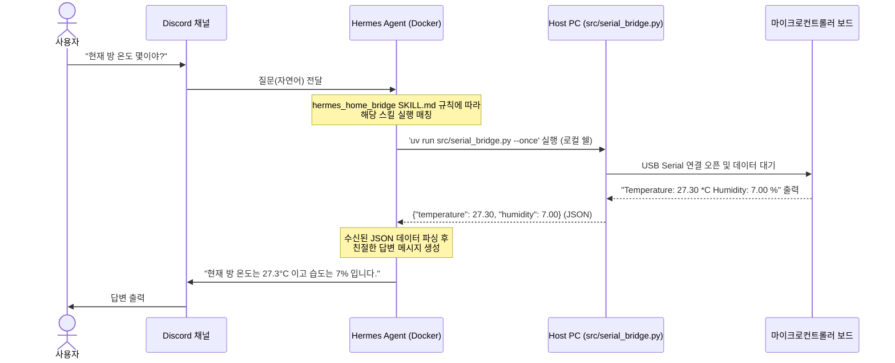

# 🌡️ hermes-home-bridge

언어 선택 (Language): [English](README.md) | [한국어](README.ko.md)

로컬 하드웨어(마이크로컨트롤러, 센서, 액추에이터)와 **Hermes Agent** API 사이를 연결하여 스마트 홈 모니터링 및 제어를 가능하게 해주는 가볍고 이식성 높은 브릿지 프로그램입니다.

---

## 🚀 주요 기능 (Features)

* **실시간 센서 모니터링**: 시리얼 통신(USB Serial)을 통해 전송되는 실시간 온도(°C) 및 습도(%) 데이터를 파싱합니다.
* **온디맨드 CLI 인터페이스**: AI 에이전트 실행에 최적화된 `--once` 플래그를 지원합니다. 호출 시 현재 센서 값을 즉시 읽어 표준 JSON 포맷(`{"temperature": 27.3, "humidity": 7.0}`)으로 출력하고 프로세스를 바로 종료합니다.
* **Hermes Agent 커스텀 스킬 연동**: 에이전트가 *"현재 방 안 온도 몇이야?"*와 같은 자연어 사용자의 의도를 파악하여 로컬 PC의 브릿지 스크립트를 직접 실행하고 답변을 생성하도록 돕습니다.
* **현대적인 Python 환경 및 보안 관리**: `uv`를 패키지 관리자로 적용하여 의존성을 깔끔하게 격리합니다. API 키나 시리얼 포트 설정과 같은 민감 정보는 `.env` 파일로 분리하여 Git 커밋 시 유출될 위험을 방지합니다.
* **양방향 제어(액추에이터) 확장 가능 구조**: 단순 수신 모니터링에 그치지 않고 에이전트가 하드웨어(예: 에어컨 제어용 IR 송신기 등)로 제어 명령을 다시 전송할 수 있도록 설계에 반영해 두었습니다.

---

## 🔌 하드웨어 요구사항 및 보드 호환성 (Hardware Setup)

본 프로젝트는 특정 보드에 종속되지 않고 **시리얼 통신을 지원하는 거의 모든 환경에서 사용 가능**합니다.

### 1. 호환되는 보드 및 센서
USB 시리얼 통신을 지원하며 정해진 포맷으로 텍스트를 출력할 수 있는 모든 마이크로컨트롤러 보드를 지원합니다.

* **지원 보드**: 
  * 아두이노 계열 (Nano, Uno, Mega, Nano 33 IoT 등)
  * ESP8266 / ESP32
  * Raspberry Pi Pico / RP2040
  * 그 외 시리얼 출력 기능이 있는 모든 보드
* **지원 센서**:
  * DHT11, DHT22 (AM2302) 또는 시리얼 출력 포맷을 `"Temperature: XX *C Humidity: XX %"` 형태로 가공할 수 있는 모든 센서.

### 2. 회로 결선 가이드 예시 (3핀 DHT 모듈 기준)
DHT 센서 모듈과 마이크로컨트롤러 보드를 다음과 같이 일대일로 연결합니다.

| 센서 핀 | 보드 연결 핀 | 역할 | 비고 |
| :--- | :--- | :--- | :--- |
| **VCC (+)** | **3.3V 또는 5V** | 전원 공급 | ⚠️ 보드의 입력 전압 로직 레벨 제한을 반드시 확인하세요 (예: Nano 33 IoT는 3.3V만 허용). |
| **GND (-)** | **GND** | 그라운드 | 공통 접지 |
| **DATA (S / Out)** | **D2 (디지털 2번 핀)** | 데이터 신호 | 측정된 온습도 디지털 신호를 보드로 전송 |

> [!IMPORTANT]
> 3핀 모듈 형태가 아닌 4핀 단품 DHT 센서를 직접 브레드보드에 꽂아 사용하는 경우, VCC와 DATA 핀 사이에 10kΩ 풀업 저항을 직접 연결해야 합니다. 이때 아두이노 보드의 입력을 보호하기 위해 풀업 전압은 반드시 보드의 로직 레벨(예: 3.3V)과 일치시켜 전원을 인가해야 합니다.

---

## 🛰️ 아키텍처 및 데이터 통신 흐름 (Flow)

디스코드 상에서 사용자가 온습도 정보를 물어보고 에이전트가 센서 값을 읽어 답변을 돌려주기까지의 데이터 흐름입니다.



---

## 🛠️ 구현 내용 (Implementation Details)

### 1. Python Serial Bridge Script (`serial_bridge.py`)
* **경로**: `src/serial_bridge.py`
* `pyserial`을 사용하여 로컬의 USB 시리얼 포트를 모니터링합니다.
* `--once` 옵션을 주어 실행 시 아두이노가 보내는 최초 10라인 중 성공적으로 읽어들인 온습도 데이터 1패킷만 추출하여 JSON 표준 스트링으로 출력 후 자동 종료됩니다.

### 2. Hermes Custom Skill (`hermes_home_bridge`)
* **경로**: `~/.silas/skills/hermes_home_bridge/SKILL.md` (또는 에이전트 실행 디렉토리 하위 `.agents/skills/hermes_home_bridge/SKILL.md`)
* 에이전트에게 "언제 이 도구를 써야 하는지(When to Use)" 자연어 예제를 가르치고, 매칭 시 실행해야 할 호스트 명령어(`uv run src/serial_bridge.py --once`)를 명세합니다.

---

## ⚙️ 설치 및 로컬 실행 방법

### 1. 패키지 의존성 설치
`uv` 패키지 관리자를 사용하여 가상환경 및 패키지를 안전하게 격리 설치합니다.
```bash
uv init
uv add pyserial requests python-dotenv
```

### 2. 환경 변수 설정
`.env.example` 파일을 복사하여 실제 사용 환경에 맞는 포트명을 기록한 `.env` 파일을 로컬에 생성합니다. (`.env` 파일은 `.gitignore`에 등록되어 안전하게 격리됩니다.)
```env
# 본인 환경에 맞는 시리얼 포트명을 입력합니다.
SERIAL_PORT=/dev/cu.usbmodem113401 # (macOS 예시)
# SERIAL_PORT=COM3                  # (Windows 예시)
# SERIAL_PORT=/dev/ttyACM0          # (Linux 예시)

BAUD_RATE=9600
```

### 3. 1회성 데이터 수동 조회 테스트
```bash
uv run src/serial_bridge.py --once
```

---

## 💡 트러블슈팅 및 향후 개선안

### 1. 습도 `6.00%` ~ `7.00%` 고정 에러
* **증상**: 입김을 불거나 위치를 옮겨도 습도만 이상치로 낮게 고정됨
* **원인**: 아두이노와 PC 간 통신 라인은 정상(nan 에러가 아님)이나, DHT11 센서 소자 자체의 노후화/불량 혹은 3.3V 구동 시 전압 부족으로 인해 습도 감지부가 정상 작동하지 않고 강제로 하한 에러 코드값을 반환하는 상태입니다.
* **해결책**: 측정 정밀도가 월등히 높은 **DHT22(AM2302, 흰색 몸체)** 센서로 교체를 권장합니다. 교체 시 아두이노 기기에 업로드되는 C++ 스케치 코드 상단에서 센서 타입을 `DHT22`로 수정하여 업로드해주시면 됩니다.
  ```cpp
  #define DHTTYPE DHT22
  ```

### 2. 에어컨 적외선(IR) 제어로의 확장
* 에이전트가 "에어컨을 켜라"고 판단하면, PC 쉘 도구를 사용해 `uv run src/serial_bridge.py --send-ir AC_ON` 형태의 파라미터 명령을 실행하도록 확장할 수 있습니다.
* `src/serial_bridge.py`가 시리얼 포트를 열어 아두이노에게 해당 트리거 문자를 전송하면 아두이노에 장착된 IR 송신 모듈이 에어컨 가동 신호를 송출하게 됩니다.
