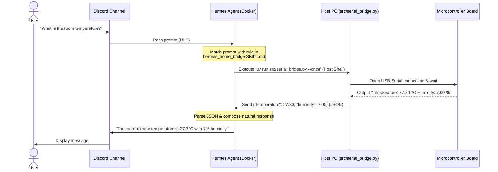

# 🌡️ hermes-home-bridge

Language: [English](README.md) | [한국어](README.ko.md)

A lightweight, portable bridge between local hardware (microcontrollers/sensors/actuators) and the **Hermes Agent** API for smart home monitoring and control.

---

## 🚀 Features

* **Real-time Sensor Monitoring**: Parses real-time temperature (°C) and humidity (%) data received via serial communication.
* **On-Demand CLI Interface**: Supports the `--once` flag designed for AI agent execution, which reads the current sensor values, prints a standardized JSON format (`{"temperature": 27.3, "humidity": 7.0}`), and terminates immediately.
* **Hermes Agent Custom Skill Integration**: Allows the agent to automatically match natural language queries (e.g., *"What is the temperature in the room?"*) and trigger the bridge script.
* **Modern Python Packaging & Security**: Powered by `uv` for seamless dependency isolation. Secrets and serial port configurations are managed via `.env` to prevent credential leaks during Git commits.
* **Future-Proof Bi-directional Control**: Designed to easily extend to actuators (like IR transmitters for AC control), allowing the agent to send control commands back to the hardware.

---

## 🔌 Hardware Setup & Broad Compatibility

This project is highly portable and **not restricted to a specific board**.

### 1. Board & Sensor Compatibility
Any microcontroller that supports USB serial communication and can print formatted strings to the serial port is fully compatible.

* **Supported Boards**: 
  * Arduino (Nano, Uno, Mega, Nano 33 IoT, etc.)
  * ESP8266 / ESP32
  * Raspberry Pi Pico / RP2040
  * Any other board capable of serial output.
* **Supported Sensors**:
  * DHT11, DHT22 (AM2302), or any sensor whose output can be formatted as `"Temperature: XX *C Humidity: XX %"`.

### 2. Wiring Reference (Example: DHT11/22 Module to Board)
Below is a standard wiring guide for 3-pin DHT modules:

| Sensor Pin | Microcontroller Pin | Role | Notes |
| :--- | :--- | :--- | :--- |
| **VCC (+)** | **3.3V or 5V** | Power Supply | ⚠️ Check your board's logic level voltage limits (e.g. Nano 33 IoT is 3.3V only). |
| **GND (-)** | **GND** | Ground | Common ground. |
| **DATA (S / Out)** | **D2 (Digital Pin 2)** | Data Output | Sends digital readings to the board. |

> [!IMPORTANT]
> If you are using a bare 4-pin DHT sensor instead of a 3-pin module, you must add a 10kΩ pull-up resistor between the VCC and DATA pins. Ensure the pull-up voltage matches your microcontroller's logic level (e.g., 3.3V for ESP32/Nano 33 IoT) to prevent damage.

---

## 🛰️ Architecture & Communication Flow

Here is how the data flows when a user asks the Hermes Agent for room conditions:



---

## 🛠️ Summary of Files (Implementation)

### 1. Python Serial Bridge Script (`serial_bridge.py`)
* **Path**: `src/serial_bridge.py`
* Monitors the local USB serial port using `pyserial`.
* The `--once` flag opens the connection, captures the first valid temperature/humidity packet from the board, prints the standard JSON format to stdout, and exits.

### 2. Hermes Custom Skill (`hermes_home_bridge`)
* **Path**: `~/.silas/skills/hermes_home_bridge/SKILL.md` (or `.agents/skills/hermes_home_bridge/SKILL.md` in agent workspace)
* Teaches the agent context clues (NLP) and configures the host command execution: `uv run src/serial_bridge.py --once`.

---

## ⚙️ Installation & Usage

### 1. Install Dependencies
Run the following commands using the `uv` package manager to initialize and install dependencies:
```bash
uv init
uv add pyserial requests python-dotenv
```

### 2. Configure Environment Variables
Create a `.env` file in the project root by copying `.env.example`. This file is ignored by Git.
```env
# Example configuration
SERIAL_PORT=/dev/cu.usbmodem113401 # (macOS)
# SERIAL_PORT=COM3                  # (Windows)
# SERIAL_PORT=/dev/ttyACM0          # (Linux)

BAUD_RATE=9600
```

### 3. Read Sensor Data Manually
```bash
uv run src/serial_bridge.py --once
```

---

## 💡 Troubleshooting & Future Roadmap

### 1. Stuck at Low Humidity (e.g., `6.00%` or `7.00%`)
* **Symptom**: Temperature changes, but humidity remains stuck at an extremely low, invalid range even when blowing moisture into the sensor.
* **Cause**: DHT11 is prone to degradation and sensor cell failure. It also requires stable power (3.5V to 5.5V); running it on a weak 3.3V line can trigger faulty measurements.
* **Solution**: Upgrade to a **DHT22 (AM2302, white body)** sensor, which has a higher dynamic range and accuracy. When upgrading, adjust the board firmware definition:
  ```cpp
  #define DHTTYPE DHT22
  ```

### 2. Actuator Expansion (AC Remote Control)
* Since the bridge communicates bi-directionally via USB Serial, you can extend the CLI to support writing control codes (e.g., `uv run src/serial_bridge.py --send-ir AC_ON`).
* The Python script will write the trigger code to the serial bus, instructing the board to fire an connected IR transmitter module to command your air conditioner.
