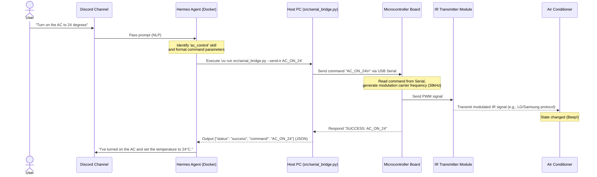
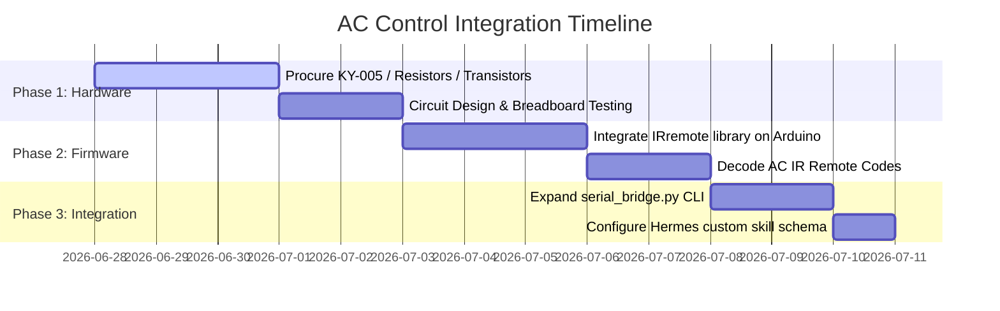

# 📑 Air Conditioner (AC) Control Integration Plan

This document outlines the architectural design, hardware requirements, and software implementation strategy to add **independent Air Conditioner control capabilities** to the `hermes-home-bridge` ecosystem. 

---

## 1. Executive Summary

While room temperature and humidity monitoring function as passive, one-shot lookup queries, **Air Conditioner control is an active, stateful command execution flow**. 

To maintain clean separation of concerns, the AC control logic will operate independently of the sensor monitoring loop. The Hermes Agent will interact with the system via a dedicated skill schema, dispatching commands to the microcontroller to trigger an Infrared (IR) transmitter.

---

## 2. System Architecture

The control flow begins with a user's natural language command on Discord, which is parsed by the Hermes Agent and translated into a direct serial code dispatched via the host PC to the microcontroller.



---

## 3. Hardware Requirements & Wiring

To enable IR transmission, the existing hardware setup must be expanded with an IR transmitter module.

### 3.1 Components Needed
* **IR Transmitter Module**: E.g., `KY-005` 38kHz IR transmitter module, or a bare IR LED with a current-limiting resistor (typically 220Ω) and a NPN transistor (e.g., `2N2222`) to boost output signal range.
* **Microcontroller Pin**: The PWM output pin is required. By default, the `IRremote` library on SAMD21 (Nano 33 IoT) uses specific pins for timer modulation (commonly **D9** or **D3**).

### 3.2 Pin Mapping Table
The physical pins will be configured as follows:

| Component | Pin on Board | Role | Signal Type |
| :--- | :--- | :--- | :--- |
| **DHT11/22 Sensor** | **D2** | Temperature/Humidity Input | Digital Input |
| **IR Transmitter (KY-005)** | **D3 (or D9)** | IR Modulation Signal Output | PWM Output (38kHz Carrier) |

> [!CAUTION]
> Bare IR LEDs pull significant current to maximize range. Do not connect a high-power IR LED directly to the microcontroller GPIO pins without a transistor driver circuit, as it may exceed the maximum current rating (e.g., 7mA for Nano 33 IoT) and degrade the board.

---

## 4. Software Implementation Strategy

### 4.1 Microcontroller Firmware (C++)
The board firmware will run a non-blocking serial listener to monitor commands without interrupting sensor reading intervals.

* **Library**: Leverage the standard `IRremote.h` library, which handles carrier frequency modulation (38kHz) and common manufacturer protocols (LG, Samsung, Daikin, Carrier, NEC).
* **Serial Handler Logic**:
  ```cpp
  #include <Arduino.h>
  #include <IRremote.h>

  IRsend irsend;

  void setup() {
    Serial.begin(9600);
    IrSender.begin(3); // Initialize IR sender on Pin 3
  }

  void loop() {
    // 1. Non-blocking Serial Command Listener
    if (Serial.available() > 0) {
      String command = Serial.readStringUntil('\n');
      command.trim();

      if (command == "AC_ON") {
        // LG AC On hex code representation
        IrSender.sendLG(0x8800909, 28); 
        Serial.println("SUCCESS: AC_ON");
      } else if (command == "AC_OFF") {
        IrSender.sendLG(0x88C000A, 28);
        Serial.println("SUCCESS: AC_OFF");
      } else {
        Serial.println("ERROR: UNKNOWN_COMMAND");
      }
    }

    // 2. Periodic Sensor Output (every 2 seconds)
    // ... Existing DHT sensor logic ...
  }
  ```

### 4.2 Python Bridge Expansion (`serial_bridge.py`)
The bridge script will be expanded to support command transmission arguments:

* **Command**: `uv run src/serial_bridge.py --send-ir <COMMAND>`
* **Logic**:
  1. Open the serial connection.
  2. Send the string command (e.g. `AC_ON\n`).
  3. Wait for the confirmation response from the board (`SUCCESS: ...`).
  4. Print the output in JSON format and exit immediately.

---

## 5. Hermes Custom Skill Expansion

A new skill, or an addition to the current `SKILL.md`, will define the AC control capabilities for the agent.

```markdown
---
name: hermes_home_bridge
description: "Monitor room temperature and control the Air Conditioner via IR."
---

## Common Commands

### Control Air Conditioner
```bash
# Turns the Air Conditioner ON
uv run src/serial_bridge.py --send-ir AC_ON

# Turns the Air Conditioner OFF
uv run src/serial_bridge.py --send-ir AC_OFF
```
```

---

## 6. Implementation Roadmap



> [!TIP]
> To decode your specific AC remote codes, you can build a temporary **IR Receiver circuit** (using a `TSOP38238` receiver pin) and run the `ReceiveDump` example from the `IRremote` library. This will output the exact protocol and hexadecimal codes needed for the firmware.
